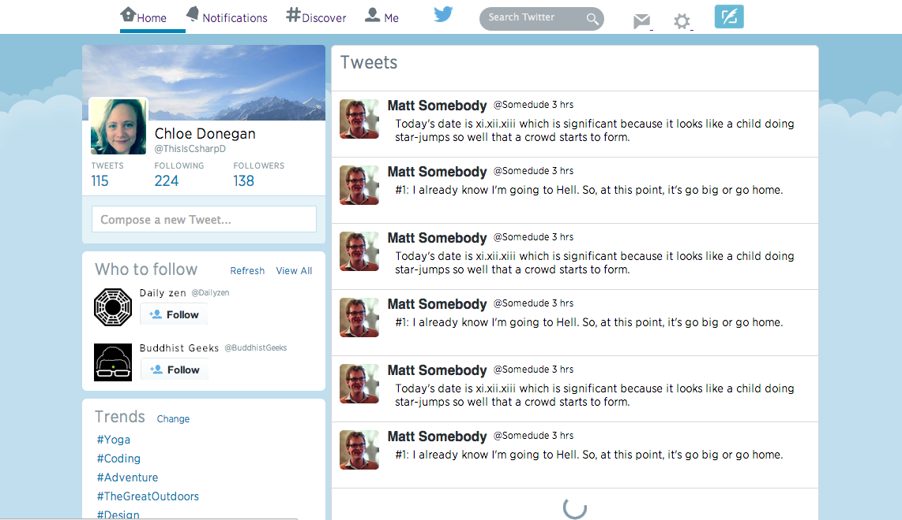

Twitter_haml
================


## Objectives

I redid my twitter front end project, this time using SCSS & HAML

## Technologies
* SCSS
* Haml
* Sinatra
* Flexbox

## How to run
```sh
git clone https://github.com/csharpd/twitter_haml.git
cd sass_twitter
bundle
rackup
```

Open your browser and go to [localhost:9292](http://localhost:9292)

## Improvments
+ Make it responsive